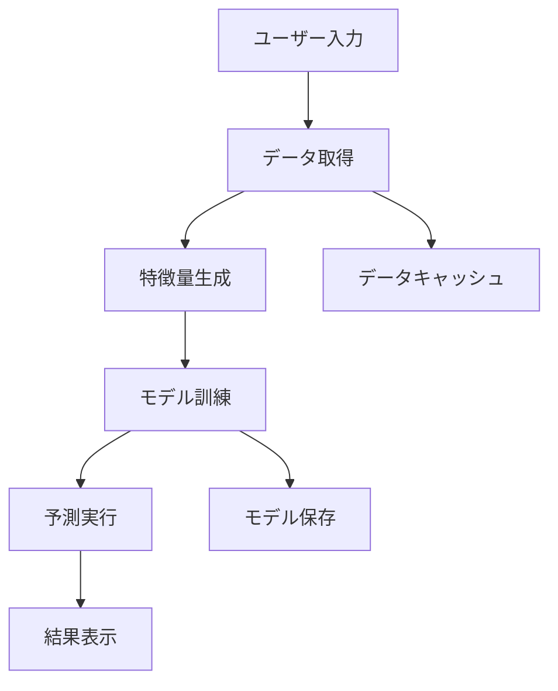
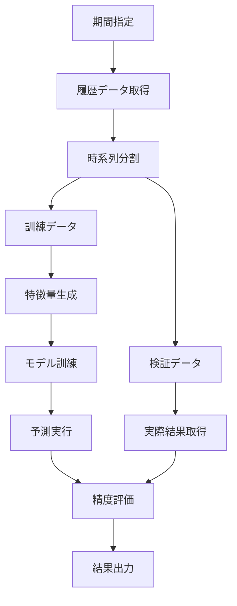

# Stock Analyzer 技術ドキュメント

## 目次

1. [アーキテクチャ概要](#アーキテクチャ概要)
2. [プロジェクト構造](#プロジェクト構造)
3. [主要コンポーネント](#主要コンポーネント)
4. [機械学習モデル](#機械学習モデル)
5. [データフロー](#データフロー)
6. [API仕様](#api仕様)
7. [開発者ガイド](#開発者ガイド)
8. [テスト戦略](#テスト戦略)
9. [パフォーマンス最適化](#パフォーマンス最適化)
10. [セキュリティ考慮事項](#セキュリティ考慮事項)

---

## アーキテクチャ概要

Stock Analyzerは、モジュラー設計を採用したPythonアプリケーションです。各機能が独立したモジュールとして設計されており、拡張性と保守性を重視しています。

### 設計原則

- **単一責任原則**: 各モジュールは明確な責任を持つ
- **依存性注入**: 依存関係を外部から注入
- **設定駆動**: 設定ファイルによる動作制御
- **ログ重視**: 構造化ログによる運用性向上
- **テスト駆動**: 包括的なテストカバレッジ

### 技術スタック

| レイヤー | 技術 | 用途 |
|----------|------|------|
| CLI | Click | コマンドラインインターフェース |
| データ分析 | pandas, numpy | データ処理・分析 |
| 機械学習 | LightGBM | 価格予測モデル |
| データ取得 | yfinance | Yahoo Finance API |
| ログ | structlog | 構造化ログ出力 |
| 設定 | YAML/JSON | 設定管理 |
| テスト | pytest, hypothesis | テストフレームワーク |
| 品質 | ruff, pyright | コード品質管理 |

---

## プロジェクト構造

```
stock-analyzer/
├── src/
│   └── stock_analyzer/          # メインパッケージ
│       ├── __init__.py
│       ├── cli/                 # CLI関連
│       │   ├── __init__.py
│       │   └── main.py          # CLIエントリーポイント
│       ├── data/                # データ取得・管理
│       │   ├── __init__.py
│       │   ├── fetchers.py      # API経由でのデータ取得
│       │   └── storage.py       # データ永続化
│       ├── analysis/            # 分析ロジック
│       │   ├── __init__.py
│       │   ├── indicators.py    # テクニカル指標
│       │   ├── features.py      # 特徴量エンジニアリング
│       │   ├── trends.py        # トレンド分析
│       │   ├── backtesting.py   # バックテスト
│       │   ├── portfolio.py     # ポートフォリオ分析
│       │   └── visualizer.py    # データ可視化
│       ├── ml/                  # 機械学習
│       │   ├── __init__.py
│       │   ├── basic_models.py  # 基本的な予測モデル
│       │   └── lightgbm_predictor.py # LightGBM実装
│       ├── reports/             # レポート生成
│       │   ├── __init__.py
│       │   ├── formatters.py    # 出力フォーマット
│       │   ├── csv_exporter.py  # CSV出力
│       │   └── generators.py    # レポート生成
│       ├── utils/               # 共通ユーティリティ
│       │   ├── __init__.py
│       │   ├── logging_config.py # ログ設定
│       │   └── helpers.py       # ヘルパー関数
│       ├── config.py            # 設定管理
│       └── types.py             # 型定義
├── tests/                       # テストコード
│   ├── unit/                    # 単体テスト
│   ├── integration/             # 統合テスト
│   ├── property/                # プロパティテスト
│   └── conftest.py             # テスト設定
├── docs/                        # ドキュメント
├── .github/                     # GitHub Actions
├── pyproject.toml              # プロジェクト設定
├── uv.lock                     # 依存関係ロック
└── CLAUDE.md                   # 開発指針
```

---

## 主要コンポーネント

### 1. データ取得モジュール (`data/`)

#### `fetchers.py`
```python
def get_stock_data(symbol: str, period: str) -> pd.DataFrame:
    """
    Yahoo Finance APIから株価データを取得

    Args:
        symbol: 株式シンボル (例: "AAPL")
        period: 取得期間 (例: "1y", "6mo")

    Returns:
        OHLCV データフレーム

    Raises:
        DataFetchError: データ取得失敗時
    """
```

**特徴**:
- エラーハンドリングとリトライ機能
- レート制限対応
- データ正規化
- キャッシュ機能（オプション）

### 2. テクニカル分析モジュール (`analysis/`)

#### `indicators.py`
主要なテクニカル指標の計算：

- **移動平均**: SMA, EMA
- **モメンタム**: RSI, MACD
- **ボラティリティ**: Bollinger Bands
- **出来高**: Volume indicators
- **トレンド**: ADX (実装予定)

```python
def calculate_rsi(data: pd.DataFrame, period: int = 14) -> pd.Series:
    """
    RSI (Relative Strength Index) を計算

    Args:
        data: OHLCV データ
        period: 計算期間

    Returns:
        RSI値のシリーズ
    """
```

#### `features.py`
機械学習用特徴量エンジニアリング：

- **価格特徴量**: 変動率、価格比率
- **テクニカル特徴量**: 指標値、シグナル
- **出来高特徴量**: 出来高パターン
- **パターン特徴量**: チャートパターン

```python
class FeatureEngineering:
    def create_features(self, data: pd.DataFrame) -> pd.DataFrame:
        """
        株価データから機械学習用特徴量を生成

        総計56個の特徴量を生成:
        - 価格特徴量: 15個
        - テクニカル特徴量: 21個
        - 出来高特徴量: 7個
        - パターン特徴量: 8個
        - 基本OHLCV: 5個
        """
```

#### `backtesting.py`
時点指定型予測シミュレーション：

```python
class BacktestSimulator:
    def run_point_in_time_simulation(
        self,
        symbol: str,
        investment_date: str,
        validation_date: str,
        training_period_months: int = 24,
        prediction_type: str = "direction"
    ) -> Dict[str, Any]:
        """
        データリーケージを防ぐ厳密な時系列分割での予測検証

        投資日以降のデータは一切使用しない
        """
```

### 3. 機械学習モジュール (`ml/`)

#### `lightgbm_predictor.py`
LightGBMベースの予測モデル：

```python
class LightGBMStockPredictor:
    def train_model(
        self,
        features: pd.DataFrame,
        targets: pd.DataFrame,
        target_columns: List[str],
        n_splits: int = 5
    ) -> None:
        """
        時系列交差検証によるモデル訓練

        - データリーケージ防止
        - ハイパーパラメータ最適化
        - 特徴量重要度計算
        """

    def predict(
        self,
        features: pd.DataFrame,
        target_columns: List[str]
    ) -> Dict[str, np.ndarray]:
        """
        訓練済みモデルで予測実行
        """
```

**モデル特徴**:
- **アルゴリズム**: LightGBM (Gradient Boosting)
- **交差検証**: TimeSeriesSplit (データリーケージ防止)
- **特徴量選択**: 重要度ベースの自動選択
- **ハイパーパラメータ**: 自動最適化

### 4. ポートフォリオ分析 (`analysis/portfolio.py`)

```python
class PortfolioAnalyzer:
    def analyze_multiple_stocks(
        self,
        symbols: List[str],
        analysis_results: Dict[str, Any],
        period: str
    ) -> Dict[str, Any]:
        """
        複数銘柄の最適ポートフォリオを構築

        - リスク・リターン最適化
        - 制約条件考慮
        - 分散投資原則適用
        """
```

---

## 機械学習モデル

### モデル設計思想

#### 1. データリーケージ防止
- **時系列分割**: 未来データを一切使用しない
- **特徴量生成**: 各時点で利用可能なデータのみ使用
- **検証手法**: TimeSeriesSplit による厳密な分割

#### 2. 特徴量設計

**価格特徴量** (15個):
```python
features = {
    "price_change_1d": data["Close"].pct_change(),
    "price_change_3d": data["Close"].pct_change(periods=3),
    "high_low_ratio": data["High"] / data["Low"],
    "close_high_ratio": data["Close"] / data["High"],
    "volatility_5d": data["Close"].rolling(5).std(),
    # ... 他10個
}
```

**テクニカル特徴量** (21個):
```python
features.update({
    "sma_5": calculate_sma(data, 5),
    "rsi_14": calculate_rsi(data, 14),
    "macd": calculate_macd(data)["macd"],
    "bb_position": bollinger_position(data),
    # ... 他17個
})
```

#### 3. 予測対象

**方向性予測** (`direction`):
- 上昇/下降の二値分類
- 閾値: 0.5 (50%以上で上昇予測)

**リターン予測** (`return`):
- パーセントリターンの回帰
- 連続値出力

### モデル評価指標

```python
metrics = {
    "direction": {
        "accuracy": accuracy_score,
        "precision": precision_score,
        "recall": recall_score,
        "f1": f1_score
    },
    "return": {
        "rmse": mean_squared_error,
        "mae": mean_absolute_error,
        "r2": r2_score
    }
}
```

---

## データフロー

### 1. リアルタイム予測フロー



### 2. バックテストフロー



### 3. データ永続化

```python
# 設定ファイル
config_path = ~/.config/stock_analyzer/config.yaml

# キャッシュディレクトリ
cache_path = ~/.cache/stock_analyzer/
├── data/           # 株価データキャッシュ
├── models/         # 訓練済みモデル
└── reports/        # 生成レポート
```

---

## API仕様

### 内部API設計

#### データ取得API
```python
# data/fetchers.py
def get_stock_data(symbol: str, period: str) -> pd.DataFrame
def get_company_info(symbol: str) -> Dict[str, Any]
def get_market_data() -> Dict[str, Any]
```

#### 分析API
```python
# analysis/indicators.py
def calculate_all_indicators(data: pd.DataFrame) -> Dict[str, float]
def analyze_signals(indicators: Dict[str, float]) -> Dict[str, str]

# analysis/features.py
def create_all_features(data: pd.DataFrame) -> Tuple[pd.DataFrame, pd.DataFrame]
```

#### 予測API
```python
# ml/lightgbm_predictor.py
class LightGBMStockPredictor:
    def train_model(...) -> None
    def predict(...) -> Dict[str, np.ndarray]
    def evaluate(...) -> Dict[str, float]
```

### 外部API依存

#### Yahoo Finance API
- **エンドポイント**: `https://query1.finance.yahoo.com/`
- **レート制限**: 1000 requests/hour
- **認証**: 不要
- **データ形式**: JSON

---

## 開発者ガイド

### 環境セットアップ

```bash
# 1. リポジトリクローン
git clone <repository-url>
cd stock-analyzer

# 2. 開発環境構築
make setup

# 3. pre-commitフック設定
uv add --dev pre-commit
pre-commit install

# 4. テスト実行
make test
```

### 開発ワークフロー

#### 1. 新機能開発
```bash
# フィーチャーブランチ作成
git checkout -b feature/new-indicator

# 開発
# - TDD (テスト駆動開発) を推奨
# - ログ出力を必須で追加
# - 型ヒントを完備

# 品質チェック
make check-all

# コミット
git add .
git commit -m "feat: add new technical indicator"

# プルリクエスト
make pr TITLE="Add new technical indicator"
```

#### 2. コーディング規約

**型ヒント必須**:
```python
def calculate_indicator(
    data: pd.DataFrame,
    period: int = 14
) -> pd.Series:
    """必ずdocstringも記述"""
```

**ログ出力必須**:
```python
logger.info("処理開始", symbol=symbol, period=period)
logger.debug("中間結果", result_count=len(result))
logger.error("エラー発生", error=str(e), exc_info=True)
```

**エラーハンドリング**:
```python
try:
    result = risky_operation()
except SpecificError as e:
    logger.error("具体的なエラー", error=str(e))
    raise ProcessingError(f"処理失敗: {e}") from e
```

### 新しいテクニカル指標の追加

#### 1. ファイル構成
```python
# analysis/indicators.py に追加
def calculate_new_indicator(
    data: pd.DataFrame,
    period: int = 20,
    **kwargs: Any
) -> Dict[str, pd.Series]:
    """
    新しいテクニカル指標を計算

    Args:
        data: OHLCV データ
        period: 計算期間

    Returns:
        指標値の辞書
    """
    logger.debug("新指標計算開始", period=period)

    # 計算ロジック
    indicator_value = complex_calculation(data, period)

    result = {"new_indicator": indicator_value}
    logger.debug("新指標計算完了", result_count=len(indicator_value))

    return result
```

#### 2. テスト追加
```python
# tests/unit/test_indicators.py
def test_calculate_new_indicator():
    """新指標の計算テスト"""
    # テストデータ準備
    data = create_test_ohlcv_data()

    # 実行
    result = calculate_new_indicator(data, period=20)

    # 検証
    assert "new_indicator" in result
    assert len(result["new_indicator"]) == len(data)
    assert not result["new_indicator"].isnull().all()
```

#### 3. CLI統合
```python
# cli/main.py の analyze コマンドに追加
indicators = calculate_all_indicators(data)
click.echo(f"新指標: {indicators.get('new_indicator', 'N/A')}")
```

### 新しい予測モデルの追加

#### 1. モデルクラス実装
```python
# ml/new_model.py
class NewPredictionModel:
    """新しい予測モデル"""

    def __init__(self, model_name: str):
        self.model_name = model_name
        self.model = None
        logger.info("新モデル初期化", model_name=model_name)

    def train(self, X: pd.DataFrame, y: pd.DataFrame) -> None:
        """モデル訓練"""
        logger.info("訓練開始", features=X.shape[1], samples=len(X))
        # 訓練ロジック

    def predict(self, X: pd.DataFrame) -> np.ndarray:
        """予測実行"""
        logger.debug("予測実行", samples=len(X))
        # 予測ロジック
```

---

## テスト戦略

### テストピラミッド

```
        /\
       /  \     E2E (統合テスト)
      /____\
     /      \
    /        \  Integration (結合テスト)
   /__________\
  /            \
 /              \ Unit (単体テスト)
/________________\
```

### 単体テスト (`tests/unit/`)

```python
# テスト例
def test_calculate_rsi():
    """RSI計算の単体テスト"""
    # Given: テストデータ
    data = pd.DataFrame({
        "Close": [100, 102, 101, 103, 104, 102, 105]
    })

    # When: RSI計算
    rsi = calculate_rsi(data, period=14)

    # Then: 結果検証
    assert isinstance(rsi, pd.Series)
    assert 0 <= rsi.iloc[-1] <= 100
    assert not pd.isna(rsi.iloc[-1])
```

### プロパティテスト (`tests/property/`)

```python
from hypothesis import given, strategies as st

@given(st.lists(st.floats(min_value=1, max_value=1000), min_size=30))
def test_rsi_properties(prices):
    """RSIの数学的性質をテスト"""
    data = pd.DataFrame({"Close": prices})
    rsi = calculate_rsi(data)

    # RSIは0-100の範囲
    assert all(0 <= x <= 100 for x in rsi.dropna())
```

### 統合テスト (`tests/integration/`)

```python
def test_full_prediction_workflow():
    """予測の全体フローテスト"""
    # データ取得からレポート生成まで
    symbol = "AAPL"

    # 1. データ取得
    data = get_stock_data(symbol, "1mo")
    assert len(data) > 0

    # 2. 特徴量生成
    features = FeatureEngineering().create_features(data)
    assert len(features.columns) > 50

    # 3. 予測実行
    predictor = LightGBMStockPredictor("test_model")
    # ... 統合テスト継続
```

### テスト実行

```bash
# 全テスト実行
make test

# カバレッジ付き実行
make test-cov

# 特定テスト実行
uv run pytest tests/unit/test_indicators.py::test_calculate_rsi -v

# プロパティテスト
uv run pytest tests/property/ -v --hypothesis-show-statistics
```

---

## パフォーマンス最適化

### 1. データ処理最適化

#### Pandas最適化
```python
# 悪い例
for index, row in df.iterrows():
    result.append(calculate_something(row))

# 良い例
result = df.apply(calculate_something, axis=1)

# さらに良い例（ベクトル化）
result = df['close'].rolling(20).mean()
```

#### メモリ使用量最適化
```python
# データタイプ最適化
def optimize_dtypes(df: pd.DataFrame) -> pd.DataFrame:
    """メモリ使用量を最適化"""
    for col in df.select_dtypes(include=['float64']).columns:
        df[col] = pd.to_numeric(df[col], downcast='float')

    for col in df.select_dtypes(include=['int64']).columns:
        df[col] = pd.to_numeric(df[col], downcast='integer')

    return df
```

### 2. 機械学習最適化

#### 特徴量選択
```python
def select_important_features(
    features: pd.DataFrame,
    importance_scores: np.ndarray,
    threshold: float = 0.01
) -> pd.DataFrame:
    """重要度の低い特徴量を除去"""
    important_features = features.columns[importance_scores > threshold]
    return features[important_features]
```

#### 並列処理
```python
from concurrent.futures import ThreadPoolExecutor

def parallel_analysis(symbols: List[str]) -> List[Dict]:
    """複数銘柄を並列分析"""
    with ThreadPoolExecutor(max_workers=4) as executor:
        futures = [
            executor.submit(analyze_symbol, symbol)
            for symbol in symbols
        ]
        return [future.result() for future in futures]
```

### 3. キャッシュ戦略

```python
from functools import lru_cache
import joblib

@lru_cache(maxsize=128)
def cached_technical_analysis(symbol: str, period: str) -> Dict:
    """テクニカル分析結果をキャッシュ"""
    return expensive_analysis(symbol, period)

def cache_model(model: Any, filepath: str) -> None:
    """訓練済みモデルをディスクキャッシュ"""
    joblib.dump(model, filepath)
```

### パフォーマンス監視

```python
from template_package.utils.profiling import profile, timeit

@profile
@timeit
def expensive_operation():
    """重い処理の監視"""
    pass
```

---

## セキュリティ考慮事項

### 1. データ保護

#### 機密情報の除外
```python
# 設定ファイルにAPIキーなど機密情報を含めない
# 環境変数を使用
import os

API_KEY = os.getenv("YAHOO_FINANCE_API_KEY", "")
if not API_KEY:
    logger.warning("API key not found in environment variables")
```

#### ログの機密情報除外
```python
def sanitize_log_data(data: Dict[str, Any]) -> Dict[str, Any]:
    """ログから機密情報を除外"""
    sensitive_keys = {"api_key", "password", "token"}
    return {
        k: "***REDACTED***" if k.lower() in sensitive_keys else v
        for k, v in data.items()
    }
```

### 2. 入力検証

```python
def validate_symbol(symbol: str) -> str:
    """株式シンボルの検証"""
    if not re.match(r'^[A-Z]{1,5}$', symbol.upper()):
        raise ValueError(f"Invalid symbol format: {symbol}")
    return symbol.upper()

def validate_period(period: str) -> str:
    """期間パラメータの検証"""
    valid_periods = {"1d", "5d", "1mo", "3mo", "6mo", "1y", "2y", "5y", "10y", "ytd", "max"}
    if period not in valid_periods:
        raise ValueError(f"Invalid period: {period}")
    return period
```

### 3. 依存関係管理

```bash
# セキュリティスキャン
uv audit

# 依存関係更新
uv update

# 脆弱性チェック
bandit -r src/
```

### 4. コード品質

```bash
# pre-commit hooks で自動チェック
repos:
  - repo: https://github.com/astral-sh/ruff-pre-commit
    hooks:
      - id: ruff
      - id: ruff-format

  - repo: https://github.com/PyCQA/bandit
    hooks:
      - id: bandit
        args: ['-c', 'pyproject.toml']
```

---

## 監視と運用

### ログ設定

```python
# 本番環境
setup_logging(
    level="INFO",
    format="json",
    log_file="/var/log/stock-analyzer/app.log"
)

# 開発環境
setup_logging(
    level="DEBUG",
    format="console",
    include_caller_info=True
)
```

### エラー監視

```python
def handle_critical_error(error: Exception) -> None:
    """重要なエラーの通知"""
    logger.critical(
        "Critical error occurred",
        error_type=type(error).__name__,
        error_message=str(error),
        traceback=traceback.format_exc(),
        exc_info=True
    )

    # 外部監視システムへの通知
    # send_alert_to_monitoring_system(error)
```

### メトリクス収集

```python
metrics = {
    "requests_total": 0,
    "predictions_made": 0,
    "errors_count": 0,
    "avg_response_time": 0.0,
    "data_freshness": datetime.now()
}

def update_metrics(metric_name: str, value: Any) -> None:
    """メトリクスの更新"""
    metrics[metric_name] = value
    logger.info("Metrics updated", metric=metric_name, value=value)
```

---

## 拡張性設計

### プラグインアーキテクチャ

```python
# 将来的なプラグイン対応
class IndicatorPlugin(Protocol):
    def calculate(self, data: pd.DataFrame) -> pd.Series:
        ...

    @property
    def name(self) -> str:
        ...

def load_plugins() -> List[IndicatorPlugin]:
    """プラグインの動的ロード"""
    plugins = []
    # プラグインディレクトリからロード
    return plugins
```

### API化準備

```python
# FastAPI統合の準備
from fastapi import FastAPI

app = FastAPI(title="Stock Analyzer API")

@app.get("/api/v1/analyze/{symbol}")
async def analyze_stock(symbol: str, period: str = "1y"):
    """RESTful API エンドポイント"""
    # 既存の分析ロジックを活用
    return await run_analysis(symbol, period)
```

---

このドキュメントは、Stock Analyzerの技術的詳細と開発ガイドラインを包括的に説明しています。新しい開発者がプロジェクトに参加する際や、機能拡張を行う際の参考資料としてご活用ください。
